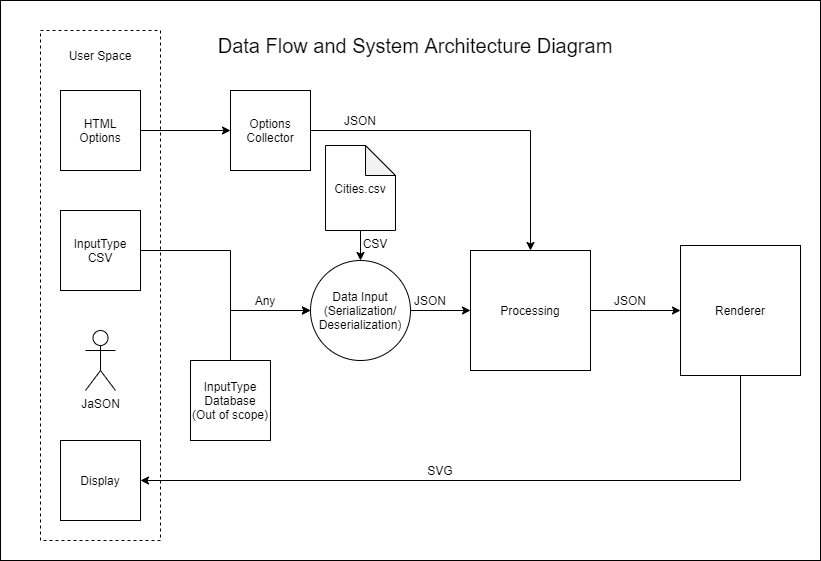

# Averitt Map Project Overview
## Table of Contents
1. [Technologies](#technologies)
	- [HTTP/CSS/JS](#httpcssjs)
	- [jCanvas](#jcanvas)
	- [jQuery](#jquery)
2. [Components](#Components)
	- [User Input Interface](#user-input-interface)
	- [User Output Interface](#user-output-interface)
		- [Empty Loads](#empty-loads)
		- [Actual Path](#actual-path)
		- [Ideal/Planned Path](#idealplanned-path)
	- [Backend Components](#backend-components)
		- [Input](#input)
		- [Processing](#processing)
		- [Output](#output)

## Technologies
The technologies used in this project are standard for web applications except for jCanvas. All code runs client-side, and there is no web server.
### HTTP/CSS/JS
The HTTP, CSS, and JavaScript collection of languages are standard for web applications.
### jCanvas
jCanvas is a JavaScript library that assists with drawing things to a canvas.
### jQuery
jQuery is a standard JavaScript library that makes code that interacts with the front-end much less verbose.

## Components

### User Input Interface
The user input interface consists of a few options:
- Service centers CSV file
- Map type selector
- Map data file (Specific to map type)
- Origin service center filter
- Destination service center filter
- Export to PDF
### User Output Interface
The user output interface consists of a canvas on which the map is drawn with the assistance of jCanvas.
#### Empty Loads
The empty loads map type shows routes that have empty trucks moving along them and how many.
#### Actual Path
The actual path map type shows the actual path taken by trucks.
#### Ideal/Planned Path
The ideal/planned map type shows the planned path that the trucks are expected to take.
### Backend Components
#### Input
Input compenents consist of the following:
- CSV Parsing
- Reading fields from HTML
- Storing the service centers CSV file in local storage
#### Processing
Processing components consist of the following:
- Data structures for ease-of-use
- Data filtering
#### Output
Output components consist of the following:
- Canvas rendering
- Canvas API